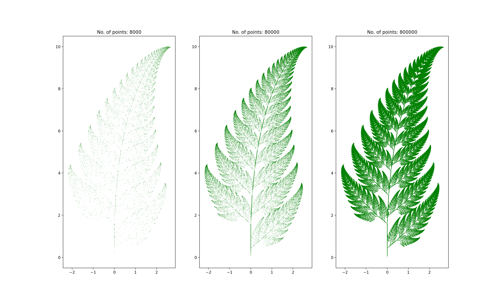
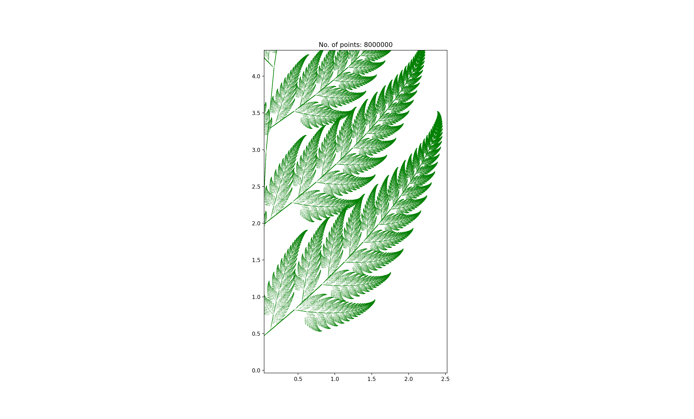

# Barnsley Fern 🌿

[Barnsley Fern](https://en.wikipedia.org/wiki/Barnsley_fern) is a fractal which resembles a
spleenwort plant.

Fractal is created using the concept of
[Iterated Function System](https://en.wikipedia.org/wiki/Iterated_function_system). We randomly
select one of four _affine transformations_ to calculate `x`, `y` coordinates.

The affine transformation in defined as a function:
```text
         ┌      ┐   ┌   ┐   ┌   ┐
         | a  b |   | x |   | e |
ƒ(x,y) = |      | * |   | + |   |
         | c  d |   | y |   | f |
         └      ┘   └   ┘   └   ┘
```
Parameters are are selected randomly with a given probability.

| w   | a     | b     | c     | d    | e   | f    | Probability | Element generated             |
| --- | ----- | ----- | ----- | ---- | --- | ---- | ----------- | ----------------------------- |
| ƒ1  | 0     | 0     | 0     | 0.16 | 0   | 0    | 0.01        | Stem                          |
| ƒ2  | 0.85  | 0.04  | −0.04 | 0.85 | 0   | 1.60 | 0.85        | Successively smaller leaflets |
| ƒ3  | 0.20  | −0.26 | 0.23  | 0.22 | 0   | 1.60 | 0.07        | Largest left-hand leaflet     |
| ƒ4  | −0.15 | 0.28  | 0.26  | 0.24 | 0   | 0.44 | 0.07        | Largest right-hand leaflet    |

## Result

 

## Further reading 📚

- [Self-similarity](https://en.wikipedia.org/wiki/Self-similarity)
- [Affine transformation](https://en.wikipedia.org/wiki/Affine_transformation)
